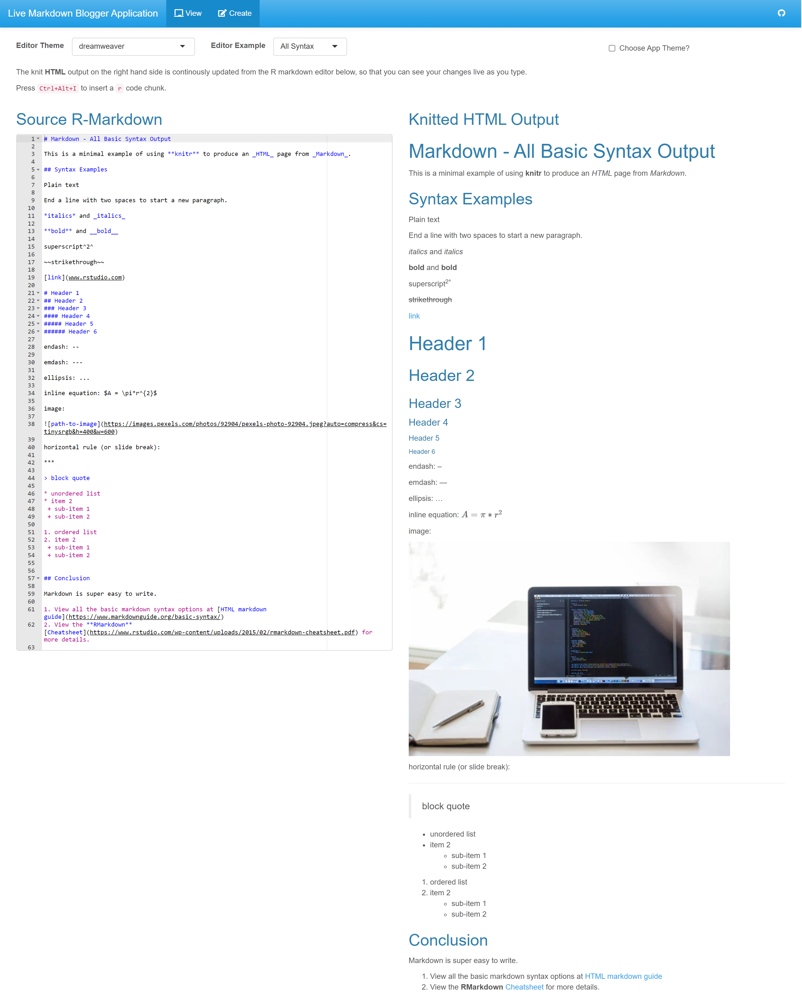
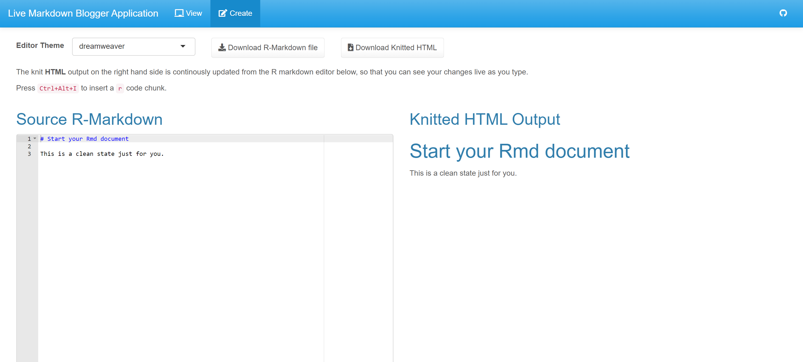
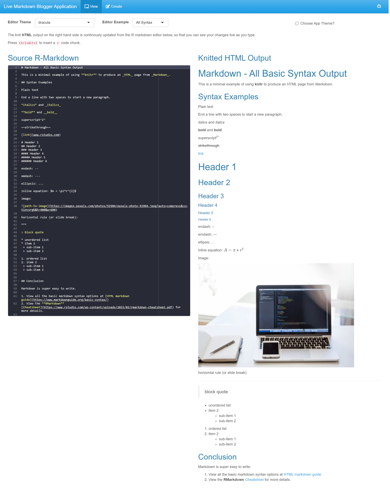
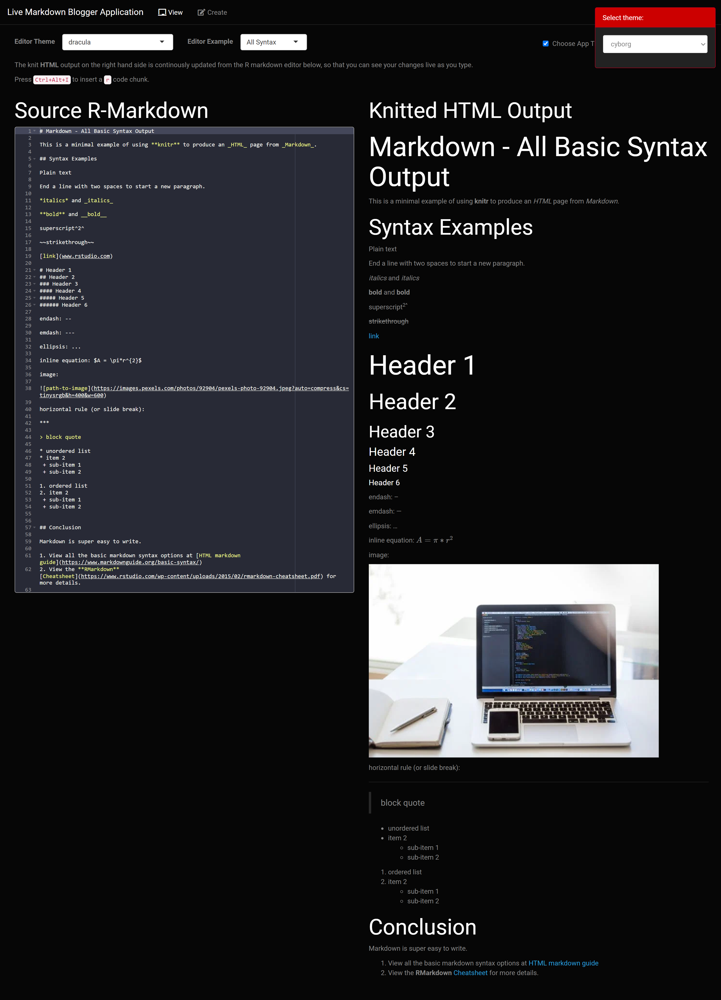

<!-- README.md is generated from README.Rmd. Please edit that file -->

<!-- badges: start -->

<!-- badges: end -->

# Introduction

This R Shiny application provides an intitutive user experenice to write markdown documents and see the live rendering on the fly. 

Since the output of markdown is native HTML, it paves way for multiple use cases of this application, few of which are listed below -

- Write blog posts directly in markdown, which can be then integrated with any web development tech stack, such as Wordpress, MERN, React, Native HTML/CSS/JS etc.
- Write custom e-mailers in markdown, which can be then automatetd to send to 100s of recipents through Robotic Process automation using R, Python, Java.
- Write project reports in markdown and style with css, so that all your reports have consitent styling and you are focused more on content creation.
- Users new to markdown format can play with this app to get a hang of its capability.

Additional fun features of this application are -

- View all available `BootStrap` themes via the Theme Selection widget.
- Fully Customize the look and feel of your R Shiny Web application or any bootstrap powered web application by defining/changing color varaibales powered by **SASS**.

## Website

The Markdown application is deployed and live at [shinyapps.io](https://mayankagrawalbond.shinyapps.io/live-knit-rmd/)

## [Dashboard Screenshots](https://mayankagrawalbond.shinyapps.io/live-knit-rmd/)

#### Home Page - View Tab

#### Create Tab

#### Editor Themes

#### App Themes

